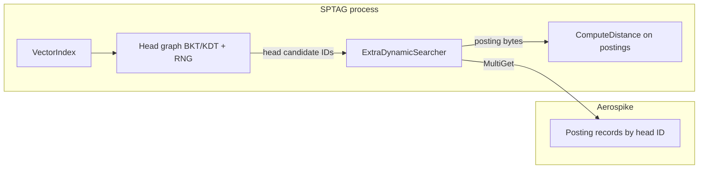

# Source map

What each top-level area owns and where Aerospike-related code lives.

## Top-level layout

| Path | Owns |
|------|------|
| `AnnService/` | Core ANN library, SPANN, KV backends, sockets, binaries |
| `Test/` | Boost.Test binary `SPTAGTest` |
| `Wrappers/` | Python / Java / WinRT bindings (SWIG) |
| `GPUSupport/` | Optional GPU paths (`-DGPU=ON`) |
| `ThirdParty/` | Vendored deps (zstd, spdk, isal-l_crypto, …) |
| `docs/` | Upstream tutorials and parameters; fork guides under `docs/guides/` |
| `datasets/` | Sample / benchmark vector blobs (see [repo-hygiene.md](../repo-hygiene.md)) |
| `Script_AE/` | Paper artifact-evaluation shell scripts (not unit tests) |
| `Tools/` | OPQ, NNI auto-tune, other research utilities |
| `CMakeLists.txt` | Root build options and subproject wiring |
| `CONTEXT.md` | Domain glossary |

## Query path (SPANN + Aerospike)

1. **Head search** — `m_index` / neighborhood graph in RAM (`AnnService/inc/Core/Common/RelativeNeighborhoodGraph.h`, BKT/KDT under `AnnService/inc/Core/BKT/`, `KDT/`).
2. **Posting fetch** — `IExtraSearcher` → `ExtraDynamicSearcher` → `KeyValueIO` (`AnnService/inc/Helper/KeyValueIO.h`).
3. **Tail scoring** — distance utilities (`AnnService/inc/Core/Common/DistanceUtils.h`, `DistanceUtils.cpp`).
4. **Top-K merge** — SPANN index and search workspace code (`AnnService/inc/Core/SPANN/Index.h`, `SearchQuery.h`, `SearchResult.h`).

Aerospike does **not** store `graph.bin`, RNG edges, or BK-tree structures.

## AnnService internals

### Core / algorithms

| Area | Path | Role |
|------|------|------|
| Index API | `inc/Core/VectorIndex.h` | Load, build, search entry |
| Storage enum | `inc/Core/DefinitionList.h` | `STATIC`, `FILEIO`, `SPDKIO`, `ROCKSDBIO`, `AEROSPIKEIO` |
| BKT / KDT | `inc/Core/BKT/`, `inc/Core/KDT/` | Tree index variants |
| Distance | `inc/Core/Common/DistanceUtils.h` | L2 / cosine / inner product SIMD |
| SPANN | `inc/Core/SPANN/` | Disk/KV-assisted index, options, extra searchers |

### Posting storage (KV)

| Component | Path |
|-----------|------|
| Abstract KV API | `inc/Helper/KeyValueIO.h` |
| Aerospike client backend | `inc/Helper/AerospikeKeyValueIO.h`, `src/Helper/AerospikeKeyValueIO.cpp` |
| File / RocksDB / SPDK controllers | `inc/Core/SPANN/ExtraFileController.h`, `ExtraRocksDBController.h`, `ExtraSPDKController.h` |
| Wiring + env | `inc/Core/SPANN/ExtraDynamicSearcher.h` (constructs `AerospikeKeyValueIO` when `Storage::AEROSPIKEIO`) |
| SPANN parameters | `inc/Core/SPANN/ParameterDefinitionList.h` (`Storage` INI key) |

### Serving and tools

| Binary / lib | Path |
|--------------|------|
| `ssdserving` | `src/SSDServing/` |
| `spfresh` | `src/SPFresh/` |
| `indexbuilder` / `indexsearcher` | `src/IndexBuilder/`, `src/IndexSearcher/` |
| `server` / `client` | `src/Server/`, `src/Client/`, `inc/Socket/Packet.h` |
| `keyvaluetest` | `src/KeyValueTest/` |

### Configuration

- INI keys generated from `ParameterDefinitionList.h` macros (BKT, KDT, SPANN).
- Example Aerospike benchmark INI: `benchmark.aerospike.ini` (repo root).

## Test layout

| Path | Role |
|------|------|
| `Test/src/*.cpp` | Boost tests compiled into one `SPTAGTest` |
| `Test/src/KVTest.cpp` | RocksDB / SPDK / File / Aerospike KV smoke tests |
| `Test/src/PerfTest.cpp`, `SPFreshTest.cpp` | Timing / benchmark-style cases |
| `Test/cuda/` | GPU tests when enabled |

## Out of scope for SPTAG repo

- **Aerospike server** — separate repository; this tree only embeds the C **client** for posting blobs.
- **Server-side VECTOR_DISTANCE** — future Aerospike server work, not implemented here.

## Related docs

- [build-matrix.md](build-matrix.md)
- [../contracts/aerospike-kv-backend.md](../contracts/aerospike-kv-backend.md)
- [../adr/0001-aerospike-stores-posting-blobs-not-ann-graph.md](../adr/0001-aerospike-stores-posting-blobs-not-ann-graph.md)
